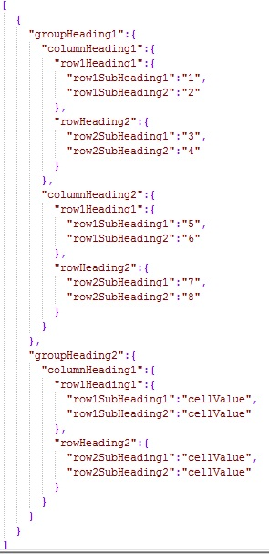
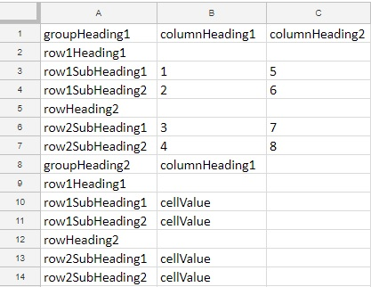

# JsonToExcel
Converts json file to excel file

## How to use:
1. Ensure that you have node installed. You can get it from here [Node](https://nodejs.org).
2. ``git clone https://github.com/StoneRox/JsonToExcel.git``
3. ``npm install`` in the comand line console from the directory of the project.
4. ``node index.js -h`` in the comand line console from the directory of the project to see what commands can be used.

### NOTE: For every element of json that is array a new worksheet will be created and filled with the corresponding data.
### NOTE: For best results use the example json structure.

## Example json:

## Result of the example json:
